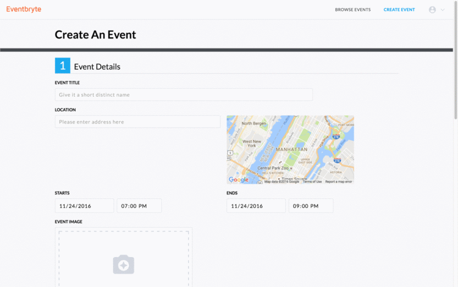
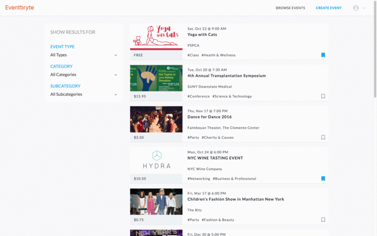

# Eventbryte

[Eventbryte LIVE](http://www.eventbryte.site)


Eventbryte is a full-stack web application inspired by [Eventbrite](http://www.eventbrite.com). It utilizes Ruby on Rails on the backend, a PostgreSQL database, and React.js with a Redux architectural framework on the front end.

## Features & Implementation

### Events

  One of the main features of Eventbryte is CRUD of events. In the database, the events are stored in `events` table which contains `title`, `description`, `organizer_id`, `type_id`, `category_id`, `subcategory_id`, `start_date`, `start_time`, `end_date`, `end_time`, `image_url`, `venue_name`, `place_id`, `address_detail`, `num_tickets`, `ticket_price` columns. Users must be logged in for creating events, but not for browsing events.

  Once the form is submitted with successful AJAX request, the user will be redirected to the event page and will be able to see the event details.

  Event form pages employ two 3rd party APIs. The first one is Google Maps API. The app utilizes its autocomplete and place id feature to improve UX. Once the user enters the address of the venue, it auto-populates all other input fields of the address and it retrieves Google Maps API's `place_id` and uses that information in the database which allows simpler schema.

  

  This app also integrates a remote asset hosting service called Cloudinary which reduces the server load and improves scalability of the app. The event image is not required. If the user does not provide the image.


### Browse Events

  

### Bookmarks/Tags/Register

### Notebooks

Implementing Notebooks started with a notebook table in the database.  The `Notebook` table contains two columns: `title` and `id`.  Additionally, a `notebook_id` column was added to the `Note` table.  

The React component structure for notebooks mirrored that of notes: the `NotebookIndex` component renders a list of `CondensedNotebook`s as subcomponents, along with one `ExpandedNotebook`, kept track of by `NotebookStore.selectedNotebook()`.  

`NotebookIndex` render method:

```javascript
render: function () {
  return ({this.state.notebooks.map(function (notebook) {
    return <CondensedNotebook notebook={notebook} />
  }
  <ExpandedNotebook notebook={this.state.selectedNotebook} />)
}
```

### Tags

As with notebooks, tags are stored in the database through a `tag` table and a join table.  The `tag` table contains the columns `id` and `tag_name`.  The `tagged_notes` table is the associated join table, which contains three columns: `id`, `tag_id`, and `note_id`.  

Tags are maintained on the frontend in the `TagStore`.  Because creating, editing, and destroying notes can potentially affect `Tag` objects, the `NoteIndex` and the `NotebookIndex` both listen to the `TagStore`.  It was not necessary to create a `Tag` component, as tags are simply rendered as part of the individual `Note` components.  


## Future Directions for the Project

In addition to the features already implemented, I plan to continue work on this project.  The next steps for FresherNote are outlined below.

### Search

Searching notes is a standard feature of Evernote.  I plan to utilize the Fuse.js library to create a fuzzy search of notes and notebooks.  This search will look go through tags, note titles, notebook titles, and note content.  

### Direct Messaging

Although this is less essential functionality, I also plan to implement messaging between FresherNote users.  To do this, I will use WebRTC so that notifications of messages happens seamlessly.  
