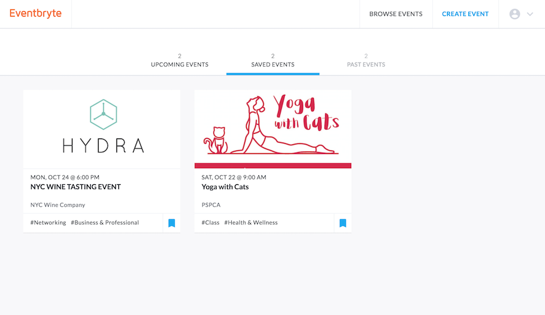
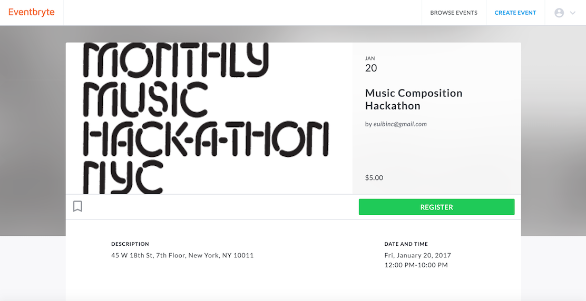
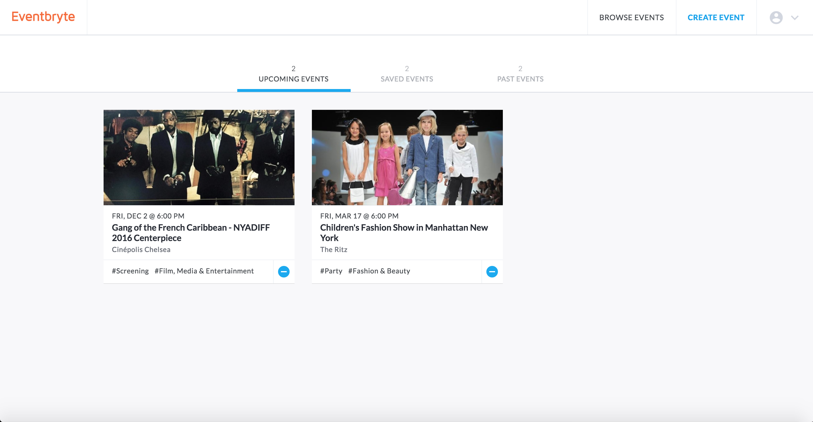
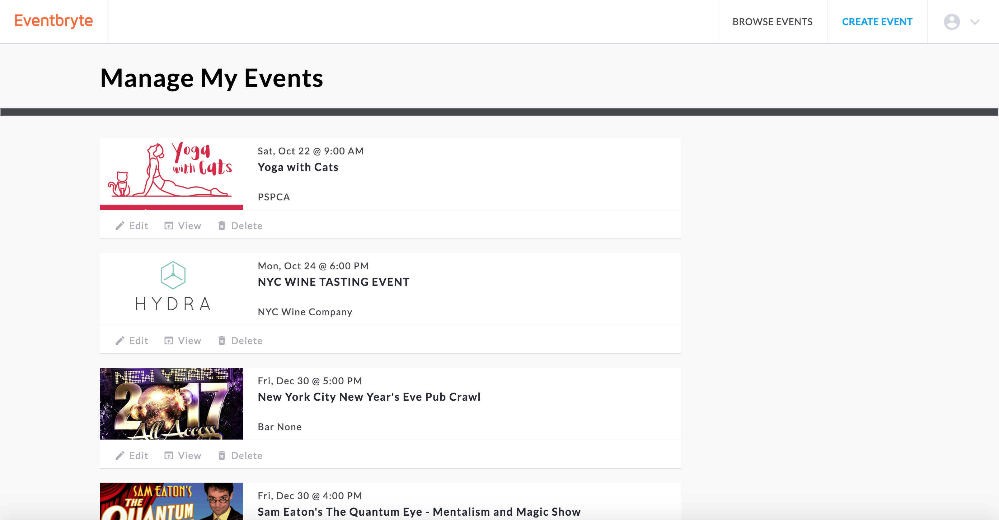

# Eventbryte

[Eventbryte LIVE](http://www.eventbryte.site)

Eventbryte is a full-stack web application inspired by [Eventbrite](http://www.eventbrite.com). It utilizes Ruby on Rails on the backend, a PostgreSQL database, and React.js with a Redux architectural framework on the front end.

## Features & Implementation

### Events

  One of the main features of Eventbryte is CRUD of events. In the database, the events are stored in `events` table which contains `title`, `description`, `organizer_id`, `type_id`, `category_id`, `subcategory_id`, `start_date`, `start_time`, `end_date`, `end_time`, `image_url`, `venue_name`, `place_id`, `address_detail`, `num_tickets`, `ticket_price` columns. Users must be logged in for creating events, but not for browsing events.

  Once the form is submitted with successful AJAX request, the user will be redirected to the event page and will be able to see the event details.

  Event form pages employ two 3rd party APIs. The first one is Google Maps API. The app utilizes its autocomplete and place id feature to improve UX. Once the user enters the address of the venue, it auto-populates all other input fields of the address and it retrieves Google Maps API's `place_id` and uses that information in the database which allows simpler schema.

  

  This app also integrates a remote asset hosting service called [Cloudinary](http://cloudinary.com/) which reduces the server load and improves scalability of the app. The event image is not required. If the user does not provide the image, the default image will be used instead.

### Browse Events

  When user clicks `BROWSE EVENTS` button in the nav bar, the browse event page will show where the user can see all events in the database. On the left side of page is a filter. User can choose a specific type, category, and/or subcategory, and the page will show only events that meet the criteria.

  For example, if a user wants to see only events whose type is `Party` and selects the appropriate type, it will update filters in the store and sends new `GET` AJAX request with the updated filters. Then, the backend will retrieve and sends back only certain events in JSON format.

  

### Bookmarks

  Another main feature of Eventbryte is bookmarking. A user can bookmark event by clicking a bookmark icon. When a user clicks a bookmark icon, the color will change to indicate that the event is bookmarked. To undo bookmarking, a user can simply click the bookmark icon again. Each bookmark will be stored in `bookmarks` table in the database with `user_id` and `event_id`. Thus, bookmarking action requires a user to be logged in.

  A user also can see his or her bookmarks in the profile page. By hovering over the user icon at the top of page, a dropdown menu will show. Then, the user can click `saved` and it will redirect the user to profile page which contains all bookmarked events.

  

  In the profile page, a user also can undo bookmarking easily by clicking the bookmark icon and it will re-render the page and the event will disappear from the page.

### Register

  Registering for events work in a very similar way as bookmarking. In each event's detail page is a toggle button for registration. A user can simply click the register button to register for the event. Once registered for the event, the button will toggle to `unregister` button.

  

  A user also can find all registered events in his/her profile easily. All upcoming events will show and each event also has toggle button so that the user can easily unregister for the event. Once the user unregisters, the page will be re-rendered and the event will disppaer.

  

  Also, if a user wants to see the past registered events, the user can click `past events` and it will show all the past events.

### Manage Events

  A user can also manage events through `manage my events` page. On the page, only the events that the user hosts will appear with `edit`, `view`, `delete` options.

  

  `edit` will redirect to event form pages. Once submitted with updated information, AJAX request with `PATCH` action will be sent. Similarly, `delete` button will send AJAX request with `DELETE` action.
